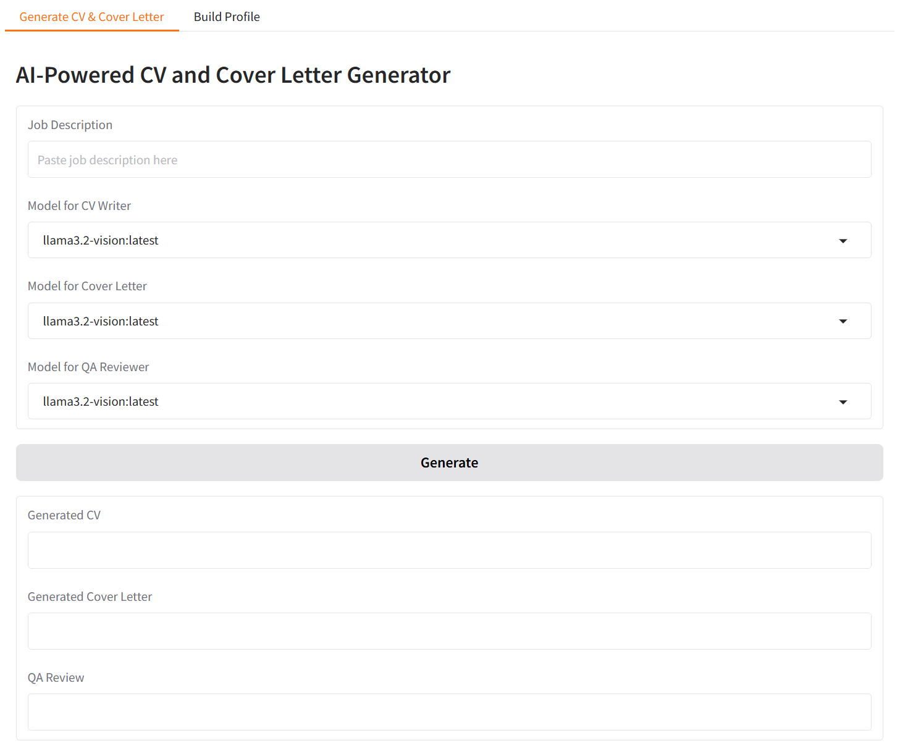
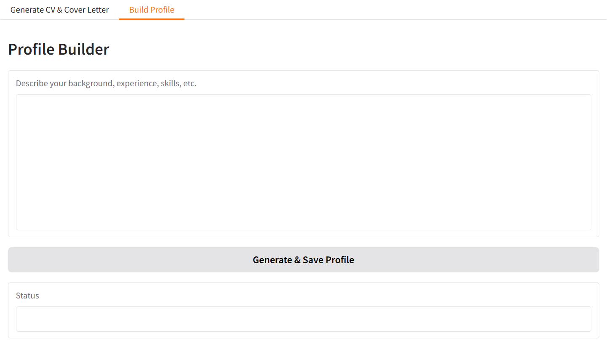

# AIJobMate

**AIJobMate** is a prototype application for generating UK-style CVs and cover letters using structured personal data and multiple AI agents orchestrated via [CrewAI](https://github.com/joaomdmoura/crewai).

## 🔧 Overview

AIJobMate works in two main steps:

1. **Build Profile**  
   Enter your professional background in freeform text. The system extracts structured data (experience, skills, education, etc.) and stores it in `data/profile.json`.

2. **Generate CV & Cover Letter**  
   Provide a job description and select which model to use for each agent:
   - 🧑‍💼 CV Writer  
   - 📝 Cover Letter Specialist  
   - ✅ Quality Assurance Reviewer  

Each agent uses a selected model (e.g. `llama3.2`, `llama3.1`) and contributes to creating well-structured documents.

## ✨ Features

- Structured profile generation from natural language input
- CrewAI-powered workflow with distinct agent roles
- Independent model selection per agent
- Quality review step before final output
- Ready to run locally with Ollama
- Modular codebase for future expansion

## 🚀 Getting Started

### 1. Clone the repository

```bash
git clone https://github.com/loglux/AIJobMate.git
cd AIJobMate
```

### 2. Set up your environment

```bash
python -m venv .venv
source .venv/bin/activate  # On Windows: .venv\Scripts\activate
pip install -r requirements.txt
```

### 3. Start your local Ollama server

```bash
ollama serve
```

Pull models you want to use, for example:

```bash
ollama pull llama3.2
```

### 4. Run the application

```bash
python gui.py
```

## 🖥️ Interface

The Gradio interface has two tabs:

### 🧱 Build Profile
Input: Your background in plain English — this can be copied from your CV, or written freely with comments and additional details. 
Output: JSON profile stored in `data/profile.json`  
Example:  
> I’ve worked in IT operations for several years, including network monitoring, scripting with Python, and automation using Docker. My most recent role involved collaboration with cross-functional teams. I’d like to highlight my ability to solve complex technical problems and communicate with both technical and non-technical stakeholders.

P.S.
🛠️ The Profile Builder currently uses the `llama3.2` model by default to extract structured JSON data from free-form text input.


### 📄 Generate CV & Cover Letter
Input:
- A job description
- Selected models for each agent

Output:
- CV
- Tailored cover letter
- QA-reviewed summary



## 📁 Project Structure

```
.
├── gui.py                  # Gradio interface
├── career_crew.py          # CrewAI agent and task logic
├── profile_manager.py      # Handles reading/writing profile JSON
├── llm_engines/
│   └── ollama_client.py    # Low-level client for Ollama models
├── data/
│   └── profile.json        # Generated user profile
├── requirements.txt
└── README.md
```

## ⚠️ Note

This is a **functioning prototype** and will continue to evolve. Expect future enhancements including:
- Editing specific sections of the profile
- Adding custom categories (e.g. Projects, Publications)
- Exporting to PDF or Word
- Support for additional LLM providers (OpenAI, DeepSeek, Mistral, etc.)

## 📌 Model Notes

You can use any local model available in your Ollama setup.  
Examples:
- `llama3.2`
- `llama3.1`
- Any other model pulled via `ollama pull`

**No specific model recommendation is made.**

## 📜 License

MIT
